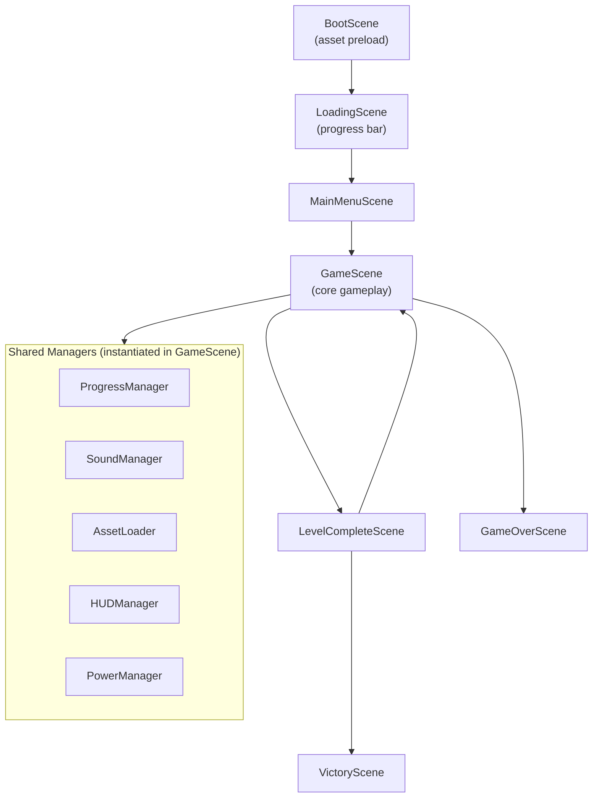

# Design Document: Bug Busters

## Overview

Bug Busters is an arcade-style web game built with **HTML5 + JavaScript** using the **Phaser 3** framework. The player controls "Kiro", a ghost avatar navigating procedurally-themed circuit board levels to eliminate software bugs before they corrupt critical modules.

The game is structured as a single-page application with no backend — all state lives in memory during a session and is persisted to `localStorage` between sessions. It targets modern desktop browsers and is designed for an IA-game contest showcasing Kiro IDE features.

### Tech Stack

| Concern | Choice | Rationale |
|---|---|---|
| Game framework | Phaser 3 (CDN) | Mature, well-documented, handles physics, input, audio, scenes |
| Language | JavaScript (ES6+) | No build step required; runs directly in browser |
| Font | Press Start 2P (Google Fonts) | Open license, pixelated aesthetic |
| Audio | Web Audio API via Phaser | Built-in, no extra dependency |
| Persistence | `localStorage` | No server needed; browser-native |
| Assets | Open-licensed / procedurally generated | Contest licensing requirement |

---

## Architecture

The game follows Phaser's **Scene-based architecture**. Each screen is a discrete Phaser `Scene`. Game logic is encapsulated in manager classes that are instantiated within scenes and passed by reference where needed.



### Scene Responsibilities

| Scene | Responsibility |
|---|---|
| `BootScene` | Registers asset keys, starts preload |
| `LoadingScene` | Displays branded loading screen + progress bar |
| `MainMenuScene` | Title, start game, shows restored high score |
| `GameScene` | Core gameplay loop, enemy AI, collision, scoring |
| `LevelCompleteScene` | Level summary, advances level counter |
| `GameOverScene` | Game over display, restart option |
| `VictoryScene` | Final score display with "I ain't afraid a no bugs" |

---

## Components and Interfaces

### AssetLoader

Responsible for registering and loading all game assets in `BootScene`. Provides fallback handling for failed loads.

```js
class AssetLoader {
  // Registra todas las claves de assets en la escena de Phaser
  preload(scene) { ... }

  // Retorna el asset de respaldo si la clave falla al cargar
  getFallback(key) { ... }
}
```

Asset manifest (all open-licensed):

| Key | Type | Source |
|---|---|---|
| `kiro` | Spritesheet | Procedurally generated / pixel art (CC0) |
| `wanderer` | Spritesheet | Procedurally generated / pixel art (CC0) |
| `seeker` | Spritesheet | Procedurally generated / pixel art (CC0) |
| `replicator` | Spritesheet | Procedurally generated / pixel art (CC0) |
| `projectile` | Image | Procedurally generated |
| `circuit_1/2/3` | Tilemap (JSON) | Procedurally designed |
| `tileset` | Image | Open-licensed tileset |
| `sfx_fire` | Audio | freesound.org (CC0) |
| `sfx_eliminate` | Audio | freesound.org (CC0) |
| `sfx_power_unlock` | Audio | freesound.org (CC0) |
| `sfx_power_activate` | Audio | freesound.org (CC0) |
| `sfx_life_lost` | Audio | freesound.org (CC0) |
| `music_game` | Audio | freesound.org (CC0) |

### SoundManager

Wraps Phaser's audio system. Respects the global mute setting.

```js
class SoundManager {
  constructor(scene, isMuted) { ... }

  // Reproduce un efecto de sonido por clave
  play(key) { ... }

  // Inicia la música de fondo en bucle
  startMusic() { ... }

  // Silencia o activa todo el audio
  setMuted(muted) { ... }
}
```

### ProgressManager

Handles `localStorage` read/write with namespaced key and graceful error handling.

```js
class ProgressManager {
  static KEY = 'bugbusters_progress';

  // Lee el progreso guardado; retorna valores por defecto si falla
  load() { ... }  // returns { level: number, score: number }

  // Guarda el progreso si supera el máximo previo
  save(level, score) { ... }
}
```

### PowerManager

Tracks unlock state and cooldown timers for Freeze and Patch_Bomb.

```js
class PowerManager {
  constructor(scene) { ... }

  // Verifica si el puntaje desbloquea nuevos poderes
  checkUnlocks(score) { ... }

  // Activa un poder si está disponible; retorna true si se activó
  activate(powerName, kiroPosition, bugs) { ... }

  // Retorna el estado actual de todos los poderes para el HUD
  getState() { ... }  // returns { freeze: PowerState, patchBomb: PowerState }
}

// PowerState: { unlocked: boolean, onCooldown: boolean, remainingCooldown: number }
```

### HUDManager

Renders and updates the HUD overlay using Phaser `Text` and `Image` objects anchored to the camera.

```js
class HUDManager {
  constructor(scene) { ... }

  // Actualiza todos los elementos del HUD en cada frame
  update(score, lives, level, powerState) { ... }
}
```

### Enemy Classes

All enemies extend a base `Bug` class:

```js
class Bug extends Phaser.Physics.Arcade.Sprite {
  constructor(scene, x, y, texture) { ... }
  get pointValue() { ... }  // abstract
  update(kiroX, kiroY) { ... }  // abstract
}

class Wanderer extends Bug {
  // Cambia de dirección aleatoriamente cada 1-3 segundos
  update() { ... }
  get pointValue() { return 10; }
}

class Seeker extends Bug {
  // Recalcula la ruta hacia Kiro cada 500ms
  update(kiroX, kiroY) { ... }
  get pointValue() { return 20; }
}

class Replicator extends Bug {
  // Genera un nuevo Wanderer cada 8 segundos, máximo 3
  update(scene) { ... }
  get pointValue() { return 30; }
  get spawnCount() { ... }
}
```

### Kiro (Player)

```js
class Kiro extends Phaser.Physics.Arcade.Sprite {
  constructor(scene, x, y) { ... }

  // Procesa el input del jugador y actualiza velocidad y animación
  update(cursors, wasd) { ... }

  // Activa el período de invencibilidad de 3 segundos
  triggerInvincibility() { ... }

  get isInvincible() { ... }
  get facing() { ... }  // 'up' | 'down' | 'left' | 'right'
}
```

### ProjectileGroup

Manages the pool of active projectiles (max 3).

```js
class ProjectileGroup extends Phaser.Physics.Arcade.Group {
  // Dispara un proyectil si hay menos de 3 activos
  fire(x, y, direction) { ... }
}
```

---

## Data Models

### Progress Object

```js
{
  level: number,   // 1-3, highest level reached
  score: number    // highest score achieved
}
```

Stored as JSON under `localStorage['bugbusters_progress']`.

### Level Configuration

```js
{
  id: number,           // 1 | 2 | 3
  tilemapKey: string,   // asset key for the tilemap JSON
  enemies: [
    { type: 'Wanderer' | 'Seeker' | 'Replicator', x: number, y: number }
  ],
  modules: [
    { x: number, y: number, integrity: number }
  ]
}
```

Level enemy counts (satisfying escalation requirement):

| Level | Wanderers | Seekers | Replicators |
|---|---|---|---|
| 1 | 3 | 1 | 0 |
| 2 | 3 | 2 | 1 |
| 3 | 2 | 3 | 2 |

### Power State

```js
{
  unlocked: boolean,
  onCooldown: boolean,
  remainingCooldown: number,  // seconds
  cooldownDuration: number    // 15 for Freeze, 20 for Patch_Bomb
}
```

### Score Unlock Thresholds

```js
const POWER_UNLOCKS = {
  freeze:     { threshold: 150, cooldown: 15 },
  patch_bomb: { threshold: 300, cooldown: 20 }
};
```

---

## Correctness Properties

*A property is a characteristic or behavior that should hold true across all valid executions of a system — essentially, a formal statement about what the system should do. Properties serve as the bridge between human-readable specifications and machine-verifiable correctness guarantees.*

### Property 1: Wanderer direction-change interval is within bounds

*For any* randomly generated direction-change timer value for a Wanderer, the interval SHALL fall within the range [1000ms, 3000ms] inclusive.

**Validates: Requirements 3.1**

---

### Property 2: Replicator spawn cap

*For any* number of spawn timer firings, the count of Wanderers spawned by a single Replicator SHALL never exceed 3.

**Validates: Requirements 3.3**

---

### Property 3: Bug collision reduces Kiro's lives by exactly one

*For any* bug type (Wanderer, Seeker, or Replicator), when Kiro collides with that bug while not invincible, Kiro's lives SHALL decrease by exactly 1 and the invincibility period SHALL be set to 3 seconds.

**Validates: Requirements 3.4**

---

### Property 4: Bug-Module collision reduces integrity by exactly one

*For any* bug type and any module with integrity > 0, when that bug collides with the module, the module's integrity SHALL decrease by exactly 1.

**Validates: Requirements 3.5**

---

### Property 5: Enemy escalation across levels

*For any* pair of consecutive levels (1→2 or 2→3), the count of Seeker enemies and the count of Replicator enemies in the later level SHALL each be strictly greater than or equal to those in the earlier level, with at least one of the two counts being strictly greater.

**Validates: Requirements 4.5**

---

### Property 6: Score increment matches bug point value

*For any* bug type, when a projectile eliminates that bug, the score SHALL increase by exactly the bug's defined point value (Wanderer: 10, Seeker: 20, Replicator: 30).

**Validates: Requirements 5.2, 5.3**

---

### Property 7: Active projectile count never exceeds 3

*For any* number of fire inputs in any game state, the count of simultaneously active projectiles SHALL never exceed 3.

**Validates: Requirements 5.5**

---

### Property 8: Freeze immobilizes all bugs

*For any* collection of bugs present on screen, activating the Freeze power SHALL set the velocity of every bug to zero and maintain that state for 5 seconds.

**Validates: Requirements 6.4**

---

### Property 9: Patch_Bomb eliminates bugs within radius only

*For any* bug position relative to Kiro, activating Patch_Bomb SHALL eliminate the bug if and only if its distance from Kiro's position is strictly less than 250 pixels.

**Validates: Requirements 6.5**

---

### Property 10: Muted audio produces no sound output

*For any* game event that would normally trigger a sound (fire, eliminate, power unlock, power activate, life lost), if the SoundManager is in muted state, no audio SHALL be played.

**Validates: Requirements 8.7**

---

### Property 11: Progress persistence saves maximum values

*For any* pair of (currentScore, currentLevel) values, after calling `ProgressManager.save()`, the stored score SHALL be `max(currentScore, previousStoredScore)` and the stored level SHALL be `max(currentLevel, previousStoredLevel)`.

**Validates: Requirements 9.1**

---

### Property 12: Progress round-trip

*For any* valid progress object `{ level, score }`, serializing it to JSON and deserializing it SHALL produce an object with identical `level` and `score` values.

**Validates: Requirements 9.5**

---

### Property 13: Malformed localStorage defaults gracefully

*For any* malformed, null, or missing value in `localStorage['bugbusters_progress']`, `ProgressManager.load()` SHALL return `{ level: 1, score: 0 }` without throwing an exception.

**Validates: Requirements 9.3**

---

### Property 14: Asset load failure uses fallback

*For any* asset key that fails to load, the AssetLoader SHALL log the error to the console and substitute a defined fallback placeholder asset without crashing the game.

**Validates: Requirements 10.2**

---

## Error Handling

| Scenario | Handling Strategy |
|---|---|
| Asset fails to load | Log to console, substitute fallback placeholder; game continues |
| `localStorage` unavailable | `ProgressManager.load()` catches exception, returns defaults |
| `localStorage` data malformed | `JSON.parse` wrapped in try/catch; returns defaults on failure |
| Replicator at spawn cap | Spawn timer fires but no new Wanderer is created; no error |
| Fire input with 3 active projectiles | `ProjectileGroup.fire()` is a no-op; no error |
| Power activated while on cooldown | `PowerManager.activate()` returns `false`; no error |
| Kiro collides while invincible | Collision handler checks `isInvincible`; no life deducted |

---

## Testing Strategy

### Approach

The game uses a **dual testing approach**:

- **Unit / example-based tests**: Verify specific behaviors, state transitions, and UI interactions using Jest with a mocked Phaser environment.
- **Property-based tests**: Verify universal invariants across randomized inputs using **fast-check** (JavaScript PBT library).

### Property-Based Testing Setup

- Library: **fast-check** (`npm install --save-dev fast-check`)
- Minimum **100 iterations** per property test
- Each property test is tagged with a comment referencing the design property:
  ```js
  // Feature: bug-busters, Property 7: Active projectile count never exceeds 3
  ```

### Test File Structure

```
tests/
  unit/
    ProgressManager.test.js   // Properties 11, 12, 13 + examples
    PowerManager.test.js      // Properties 8, 9 + examples
    SoundManager.test.js      // Property 10 + examples
    AssetLoader.test.js       // Property 14 + examples
    Wanderer.test.js          // Property 1 + examples
    Replicator.test.js        // Property 2 + examples
    Kiro.test.js              // Property 3 + examples
    Module.test.js            // Property 4 + examples
    ProjectileGroup.test.js   // Property 7 + examples
    ScoreSystem.test.js       // Properties 5, 6 + examples
```

### Property Test Configuration

```js
// Ejemplo de configuración de fast-check para 100 iteraciones mínimas
fc.assert(
  fc.property(fc.integer({ min: 0, max: 10000 }), (fireCount) => {
    // Feature: bug-busters, Property 7: Active projectile count never exceeds 3
    const group = new ProjectileGroup(mockScene);
    for (let i = 0; i < fireCount; i++) group.fire(0, 0, 'right');
    return group.getChildren().filter(p => p.active).length <= 3;
  }),
  { numRuns: 100 }
);
```

### Unit Test Focus Areas

- Scene transitions (loading → menu → game → level complete → victory/game over)
- HUD update correctness after each game event
- Enemy spawn positions at level start
- Cooldown timer accuracy for powers
- Score threshold triggers for power unlocks
- Sound effect calls (mocked Phaser audio)

### Integration Tests

- Full level play-through simulation (spawn enemies, eliminate all, verify level-complete transition)
- `localStorage` read/write cycle with real browser storage API
