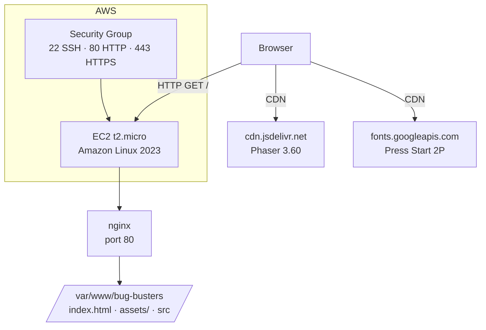

# Design Document — ec2-static-deploy

## Overview

Bug Busters is a pure static web game: `index.html` + `assets/` + `src/` (ES6 modules). There is no build step, no backend, and no environment variables. The server's only job is to serve files with the correct MIME types so the browser can load ES6 modules (`.js` → `application/javascript`) and Tiled tilemaps (`.json` → `application/json`). Phaser 3 and Google Fonts are fetched by the client from CDN — the server never touches them.

The deployment target is an AWS EC2 Free Tier instance (t2.micro, Amazon Linux 2023) running nginx. A single shell script (`deploy.sh`) automates the full provisioning sequence and doubles as an EC2 user-data script for first-boot automation.

**Local baseline:** Before any EC2 deployment, the operator verifies the game works locally with `npx serve .`, which serves `.js` as `application/javascript` and `.json` as `application/json` by default. The nginx configuration must replicate this behavior exactly.

---

## Architecture



The EC2 instance sits behind a Security Group that allows SSH from the operator's IP, HTTP from anywhere, and optionally HTTPS from anywhere. All outbound traffic is allowed so the instance can reach package repositories during provisioning.

---

## Components and Interfaces

### 1. EC2 Instance

| Property | Value |
|---|---|
| AMI | Amazon Linux 2023 (latest) |
| Instance type | t2.micro (Free Tier) |
| Key pair | Operator-provided, attached at launch |
| Public IP | Auto-assigned (or Elastic IP for stability) |
| User data | `deploy.sh` (optional, for first-boot automation) |

### 2. Security Group

| Direction | Protocol | Port | Source/Dest |
|---|---|---|---|
| Inbound | TCP | 22 | Operator IP/32 |
| Inbound | TCP | 80 | 0.0.0.0/0 |
| Inbound | TCP | 443 | 0.0.0.0/0 (HTTPS only) |
| Outbound | All | All | 0.0.0.0/0 |

AWS security groups deny all inbound traffic not explicitly listed — no additional deny rules are needed.

### 3. nginx Server Block

nginx is installed via `dnf` and configured with a single server block. The critical requirement is correct MIME types for ES6 modules and JSON tilemaps.

**Configuration file:** `/etc/nginx/conf.d/bug-busters.conf`

```nginx
server {
    listen 80;
    server_name _;

    root /var/www/bug-busters;
    index index.html;

    # MIME types críticos para ES6 modules y tilemaps
    types {
        text/html                   html htm;
        application/javascript      js mjs;
        application/json            json;
        text/css                    css;
        image/png                   png;
        image/x-icon                ico;
        audio/mpeg                  mp3;
    }

    location / {
        try_files $uri $uri/ =404;
    }
}
```

The `types {}` block inside the server block overrides nginx's global MIME types for this vhost, ensuring `.js` → `application/javascript` and `.json` → `application/json` regardless of the system-level `mime.types` file.

**Why override MIME types explicitly?** Amazon Linux 2023's nginx package ships with `mime.types` that maps `.js` to `text/javascript`. Browsers accept both, but some strict ES6 module loaders require `application/javascript`. Explicit override eliminates any ambiguity and exactly replicates `npx serve .` behavior.

### 4. Deploy Script (`deploy.sh`)

A single Bash script that runs all provisioning steps in order. Designed to be:
- Run via SSH on an already-running instance: `bash deploy.sh`
- Used as EC2 user-data for first-boot automation
- Idempotent: safe to run multiple times on the same instance

**Script structure:**

```bash
#!/bin/bash
set -euo pipefail

REPO_URL="https://github.com/<owner>/bug-busters.git"
DEPLOY_DIR="/var/www/bug-busters"
NGINX_CONF="/etc/nginx/conf.d/bug-busters.conf"

log() { echo "[$(date '+%Y-%m-%d %H:%M:%S')] $*"; }

# Paso 1: Actualizar el sistema
log "Actualizando paquetes del sistema..."
dnf update -y

# Paso 2: Instalar nginx y git
log "Instalando nginx y git..."
dnf install -y nginx git

# Paso 3: Clonar o actualizar los archivos del juego
log "Desplegando archivos del juego en $DEPLOY_DIR..."
if [ -d "$DEPLOY_DIR/.git" ]; then
    git -C "$DEPLOY_DIR" pull
else
    rm -rf "$DEPLOY_DIR"
    git clone "$REPO_URL" "$DEPLOY_DIR"
fi

# Paso 4: Eliminar archivos innecesarios para producción
log "Eliminando archivos de desarrollo..."
rm -rf "$DEPLOY_DIR/tests" \
       "$DEPLOY_DIR/node_modules" \
       "$DEPLOY_DIR/jest.config.js" \
       "$DEPLOY_DIR/babel.config.js" \
       "$DEPLOY_DIR/package.json" \
       "$DEPLOY_DIR/package-lock.json" \
       "$DEPLOY_DIR/logs" \
       "$DEPLOY_DIR/.kiro"

# Paso 5: Permisos de archivos
log "Configurando permisos..."
chown -R nginx:nginx "$DEPLOY_DIR"
find "$DEPLOY_DIR" -type d -exec chmod 755 {} \;
find "$DEPLOY_DIR" -type f -exec chmod 644 {} \;

# Paso 6: Escribir configuración de nginx
log "Escribiendo configuración de nginx..."
cat > "$NGINX_CONF" << 'EOF'
server {
    listen 80;
    server_name _;

    root /var/www/bug-busters;
    index index.html;

    types {
        text/html                   html htm;
        application/javascript      js mjs;
        application/json            json;
        text/css                    css;
        image/png                   png;
        image/x-icon                ico;
        audio/mpeg                  mp3;
    }

    location / {
        try_files $uri $uri/ =404;
    }
}
EOF

# Paso 7: Validar configuración y arrancar nginx
log "Validando configuración de nginx..."
nginx -t

log "Habilitando e iniciando nginx..."
systemctl enable nginx
systemctl restart nginx

log "Despliegue completado. El juego está disponible en http://$(curl -s http://169.254.169.254/latest/meta-data/public-ipv4)/"
```

### 5. File Layout on the Server

```
/var/www/bug-busters/
├── index.html          ← punto de entrada del juego
├── favicon.ico
├── assets/
│   ├── audio/          ← MP3 (sfx + música)
│   ├── sprites/        ← PNG (spritesheets, tileset)
│   └── tilemaps/       ← JSON (circuit_1, circuit_2, circuit_3)
└── src/
    ├── config/         ← constants.js, levels.js
    ├── entities/       ← Bug.js, Kiro.js, Wanderer.js, ...
    ├── managers/       ← AssetLoader.js, SoundManager.js, ...
    ├── scenes/         ← BootScene.js, GameScene.js, ...
    └── shaders/        ← CRTShader.js
```

Files excluded from the server (not needed to serve the game):
- `tests/`, `node_modules/`, `jest.config.js`, `babel.config.js`
- `package.json`, `package-lock.json`, `logs/`, `.kiro/`

---

## Data Models

This is a static file deployment — there are no application data models. The relevant "data" is the file system layout and nginx configuration state.

### Deployment State

| State | Description |
|---|---|
| Unprovisioned | Fresh EC2 instance, no nginx, no game files |
| Provisioned | nginx installed, game files present, service running |
| Updated | `deploy.sh` run again — git pull, permissions reset, nginx restarted |
| HTTPS-enabled | Certbot certificate obtained, nginx redirects 80→443 |

### nginx MIME Type Mapping (critical)

| Extension | Content-Type | Required for |
|---|---|---|
| `.js` | `application/javascript` | ES6 module loading (`<script type="module">`) |
| `.json` | `application/json` | Tiled tilemap loading by Phaser |
| `.png` | `image/png` | Sprite and tileset images |
| `.mp3` | `audio/mpeg` | Game audio |
| `.ico` | `image/x-icon` | Browser favicon |
| `.html` | `text/html` | Entry point |

---

## Error Handling

### Deploy Script Errors

The script uses `set -euo pipefail` at the top:
- `set -e` — exit immediately on any command failure
- `set -u` — treat unset variables as errors
- `set -o pipefail` — catch failures in piped commands

Each major step is logged with a timestamp before execution. If a step fails, the script exits with a non-zero code and the last log line indicates which step failed.

**Common failure scenarios:**

| Failure | Cause | Resolution |
|---|---|---|
| `dnf update` fails | No internet / DNS issue | Verify security group outbound rules allow all traffic |
| `git clone` fails | Wrong repo URL or no network | Check `REPO_URL` variable and EC2 outbound access |
| `nginx -t` fails | Syntax error in generated config | Check the heredoc in the script for typos |
| `systemctl restart nginx` fails | Port 80 already in use | Check for conflicting services (`ss -tlnp`) |
| Certbot fails | DNS not pointing to EC2 IP | Verify A record before running HTTPS setup |

### nginx Error Responses

| Scenario | nginx Behavior |
|---|---|
| File not found | Returns HTTP 404 (via `try_files $uri $uri/ =404`) |
| nginx not running | Connection refused (OS-level) |
| Wrong MIME type | Browser rejects ES6 module with CORS/MIME error in console |

### HTTPS / Certbot Errors

Certbot requires:
1. Port 80 open and nginx serving HTTP (for ACME HTTP-01 challenge)
2. DNS A record pointing to the EC2 public IP
3. Port 443 open in the Security Group

If any of these are missing, `certbot --nginx` will fail with a descriptive error message. The operator must resolve DNS and security group configuration before running the HTTPS setup step.

---

## Optional HTTPS Path

HTTPS is optional and requires a registered domain name. The steps below are run manually after the base deployment is working on HTTP.

```bash
# Instalar Certbot y el plugin de nginx
dnf install -y certbot python3-certbot-nginx

# Obtener e instalar el certificado (reemplaza example.com con tu dominio)
certbot --nginx -d example.com -d www.example.com

# Verificar renovación automática
systemctl status certbot-renew.timer
```

Certbot modifies the nginx server block automatically to:
- Add `listen 443 ssl` with certificate paths
- Add a redirect from port 80 to 443

The `certbot-renew.timer` systemd timer runs twice daily and renews certificates that expire within 30 days.

**Prerequisites checklist before running Certbot:**
1. DNS A record for the domain points to the EC2 public IP
2. Port 443 is open in the Security Group
3. nginx is running and serving HTTP on port 80
4. The domain resolves correctly (`dig example.com`)

---

## Testing Strategy

This feature is infrastructure and deployment automation — shell scripts, nginx configuration, and AWS resource setup. Property-based testing is not applicable here because:
- There are no pure functions with meaningful input variation
- All acceptance criteria are configuration checks (SMOKE) or HTTP response verifications (INTEGRATION)
- Running 100 iterations of "is nginx installed?" adds no value

The appropriate testing strategy is a combination of smoke tests and integration tests run manually after deployment.

### Pre-Deployment (Local)

Run locally before touching EC2:

```bash
# Verificar que el juego funciona con el servidor local de referencia
npx serve .
# Abrir http://localhost:3000 y verificar:
# - El juego carga sin errores en la consola del navegador
# - Los módulos ES6 se cargan (Network tab: .js con Content-Type: application/javascript)
# - Los tilemaps se cargan (Network tab: .json con Content-Type: application/json)
# - El audio y los sprites se cargan correctamente
```

### Post-Deployment Smoke Tests

Run after `deploy.sh` completes:

```bash
EC2_IP="<your-ec2-public-ip>"

# 1. nginx está corriendo
ssh ec2-user@$EC2_IP "systemctl is-active nginx"

# 2. nginx arranca automáticamente al reiniciar
ssh ec2-user@$EC2_IP "systemctl is-enabled nginx"

# 3. Los archivos del juego están presentes
ssh ec2-user@$EC2_IP "ls /var/www/bug-busters/{index.html,favicon.ico,assets,src}"

# 4. Los archivos de test están excluidos
ssh ec2-user@$EC2_IP "test ! -d /var/www/bug-busters/tests && echo 'OK: tests/ excluido'"

# 5. Permisos correctos
ssh ec2-user@$EC2_IP "stat -c '%U %a' /var/www/bug-busters/index.html"
# Esperado: nginx 644
```

### Post-Deployment Integration Tests

Verify HTTP behavior with `curl`:

```bash
EC2_IP="<your-ec2-public-ip>"

# 1. index.html responde con 200
curl -s -o /dev/null -w "%{http_code}" http://$EC2_IP/
# Esperado: 200

# 2. .js se sirve con application/javascript
curl -s -I http://$EC2_IP/src/config/constants.js | grep -i content-type
# Esperado: content-type: application/javascript

# 3. .json se sirve con application/json
curl -s -I http://$EC2_IP/assets/tilemaps/circuit_1.json | grep -i content-type
# Esperado: content-type: application/json

# 4. .png se sirve con image/png
curl -s -I http://$EC2_IP/assets/sprites/kiro.png | grep -i content-type
# Esperado: content-type: image/png

# 5. .mp3 se sirve con audio/mpeg
curl -s -I http://$EC2_IP/assets/audio/loop.mp3 | grep -i content-type
# Esperado: content-type: audio/mpeg

# 6. Archivo inexistente devuelve 404
curl -s -o /dev/null -w "%{http_code}" http://$EC2_IP/nonexistent.html
# Esperado: 404

# 7. Idempotencia: ejecutar el script dos veces no falla
ssh ec2-user@$EC2_IP "bash /tmp/deploy.sh && echo 'Segunda ejecución: OK'"
```

### HTTPS Integration Tests (optional)

```bash
DOMAIN="example.com"

# 1. HTTP redirige a HTTPS
curl -s -o /dev/null -w "%{http_code}" http://$DOMAIN/
# Esperado: 301

# 2. HTTPS responde con 200
curl -s -o /dev/null -w "%{http_code}" https://$DOMAIN/
# Esperado: 200

# 3. Certificado válido
curl -s -I https://$DOMAIN/ | grep -i strict-transport
# Esperado: strict-transport-security header presente (si Certbot lo añade)
```
