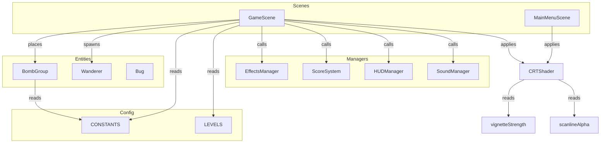

# Design Document — gameplay-overhaul

## Overview

This overhaul touches six independent areas of Bug Busters' core gameplay loop. Each area is scoped to a minimal set of files and follows the existing Phaser 3 patterns established in the codebase.

| Area | Scope |
|------|-------|
| 1. Bomb mechanic | `GameScene`, `CONSTANTS`, new `BombGroup` entity |
| 2. Score-based spawn limit | `LEVELS`, `GameScene._spawnEnemies` |
| 3. Wanderer spawn fix | `GameScene._spawnEnemies`, `_setupBugCollisions` |
| 4. CRT shader readability | `CRTShader.js` (two numeric constants) |
| 5. Auto game-over fix | `GameScene` (remove score-based timer/callback) |
| 6. Pause mechanic | `GameScene` (pause overlay, ESC/P keys) |

No new scenes are required. The pause screen is implemented as an in-scene overlay group, not a separate Phaser scene, to keep the pause/resume cycle simple and avoid scene-stack complexity.

---

## Architecture



The `ProjectileGroup` entity is removed entirely. `BombGroup` replaces it with stationary-bomb semantics.

---

## Components and Interfaces

### 1. BombGroup (`src/entities/BombGroup.js`)

New entity replacing `ProjectileGroup`. Manages a pool of stationary bomb objects.

```js
class BombGroup extends BaseGroup {
  // Coloca una bomba en la posición de tile de Kiro si no se alcanzó el límite
  placeBomb(x, y): void

  // Detona una bomba específica (por contacto con Bug o por fuse timeout)
  detonateBomb(bomb): void

  // Retorna el número de bombas activas actualmente
  getActiveCount(): number
}
```

Each bomb object in the pool carries:
- `x`, `y` — snapped tile position (multiples of 32 px)
- `active` — boolean, managed via `setActive(false)` on detonation
- `fuseTimer` — a `Phaser.Time.TimerEvent` reference, cancelled on early detonation

**Tile snapping formula:**
```js
const TILE_SIZE = 32;
const snappedX = Math.round(x / TILE_SIZE) * TILE_SIZE + TILE_SIZE / 2;
const snappedY = Math.round(y / TILE_SIZE) * TILE_SIZE + TILE_SIZE / 2;
```

**New CONSTANTS entries:**
```js
BOMB_LIMIT: 3,           // máximo de bombas activas simultáneamente
BOMB_FUSE_DURATION: 3000 // duración del fusible en milisegundos
```

### 2. GameScene changes

**Removed:**
- `this._projectiles = new ProjectileGroup(this)`
- `this._fireProjectile()` method
- `this.input.on('pointerdown', () => this._fireProjectile())`
- `this._spaceKey` fire handler (repurposed to bomb placement)
- `_onProjectileHitBug` handler
- All `physics.add.overlap(this._projectiles, ...)` calls

**Added:**
- `this._bombs = new BombGroup(this)` in `create()`
- `_placeBomb()` — places a bomb at Kiro's snapped tile position
- `_onBombHitBug(bomb, bug)` — overlap handler: detonates bomb, eliminates bug
- `_setupBombCollisions()` — registers bomb↔bug overlaps for all bugs
- Pause state: `this._paused = false`
- `_pauseOverlay` — a Phaser Container holding the pause UI elements
- `_togglePause()` — pauses/resumes scene time and shows/hides overlay
- ESC and P key listeners calling `_togglePause()`

**Modified:**
- `_spawnEnemies(levelConfig)` — adds spawn threshold tracking (see §2 below)
- `_checkWinCondition()` — adds `this._spawnThresholdReached` guard
- `update()` — adds pause guard; replaces projectile fire with bomb placement

**Pause guard in update():**
```js
update() {
  if (this._transitioning) return;
  if (this._paused) return;
  // ... rest of update
}
```

### 3. Spawn System changes (inside GameScene)

New state tracked in `create()`:
```js
this._spawnedPointTotal = 0;
this._spawnThresholdReached = false;
```

`_spawnEnemies` becomes a sequential loop that stops when `_spawnedPointTotal >= levelConfig.spawnThreshold`. Replicator-spawned Wanderers call `_bugs.push` and `_setupBugCollisions` directly without touching `_spawnedPointTotal`.

### 4. CRTShader constants

Only two lines change in `CRTShader.js`:
```js
// Before:
this.vignetteStrength = 0.4;
this.scanlineAlpha    = 0.15;

// After:
this.vignetteStrength = 0.25;  // brightness at dist=1 → 0.75 (meets req 4.1)
this.scanlineAlpha    = 0.18;  // odd-row brightness → 0.82 (meets req 4.2)
```

Rationale: `vignetteValue(1.0, 0.25) = 0.75` exactly satisfies the ≥ 0.75 constraint at the worst-case screen edge. `scanlineValue(odd, 0.18) = 0.82 ≥ 0.80`. Both values keep the CRT aesthetic visible (non-zero).

### 5. Auto game-over fix

The existing `GameScene` has no explicit score-based game-over timer visible in the current source, but the requirement mandates a defensive removal. The fix is:
- Audit `create()` for any `this.time.addEvent` or `this.time.delayedCall` that references `_scoreSystem.getScore()` and calls `_gameOver()` — remove if found.
- `_checkWinCondition()` is already score-agnostic; no change needed there.
- `_onBugHitKiro` already gates on `this._lives <= 0` — correct.

### 6. Pause overlay

Implemented as a `Phaser.GameObjects.Container` with `setDepth(1000)` and `setScrollFactor(0)`, created once in `create()` and toggled visible/invisible.

Contents:
- Semi-transparent black rectangle (full screen, alpha 0.6)
- "PAUSED" text — `"Press Start 2P"`, 24px, white, centred
- "RESUME" text — `"Press Start 2P"`, 16px, white, interactive
- "QUIT" text — `"Press Start 2P"`, 16px, white, interactive

`_togglePause()` logic:
```js
_togglePause() {
  this._paused = !this._paused;
  if (this._paused) {
    this.time.paused = true;
    this.physics.pause();
    this._pauseOverlay.setVisible(true);
  } else {
    this.time.paused = false;
    this.physics.resume();
    this._pauseOverlay.setVisible(false);
  }
}
```

Using `this.physics.pause()` / `this.physics.resume()` halts all arcade physics bodies (bugs, Kiro, bombs) automatically, satisfying requirement 6.6 without needing per-entity checks.

---

## Data Models

### CONSTANTS additions

```js
// --- Bombas ---
BOMB_LIMIT: 3,            // máximo de bombas activas simultáneamente
BOMB_FUSE_DURATION: 3000  // duración del fusible en milisegundos (ms)
```

### LEVELS additions

Each level entry gains a `spawnThreshold` field:

```js
{ id: 1, spawnThreshold: 10,  tilemapKey: 'circuit_1', enemies: [...], modules: [...] }
{ id: 2, spawnThreshold: 15,  tilemapKey: 'circuit_2', enemies: [...], modules: [...] }
{ id: 3, spawnThreshold: 20,  tilemapKey: 'circuit_3', enemies: [...], modules: [...] }
```

### Bomb object (pool member)

```js
{
  x: number,           // posición X snapeada al tile
  y: number,           // posición Y snapeada al tile
  active: boolean,     // false cuando detonada
  fuseTimer: TimerEvent | null  // referencia al timer del fusible
}
```

### Spawn tracking state (GameScene)

```js
this._spawnedPointTotal = 0;       // suma de puntos de enemigos ya spawneados
this._spawnThresholdReached = false; // true cuando total >= spawnThreshold
```

---

## Correctness Properties

*A property is a characteristic or behavior that should hold true across all valid executions of a system — essentially, a formal statement about what the system should do. Properties serve as the bridge between human-readable specifications and machine-verifiable correctness guarantees.*

### Property 1: Bomb placement respects tile snapping

*For any* Kiro position (x, y), calling `placeBomb(x, y)` should add a bomb whose position equals the nearest tile centre, and the active bomb count should increase by one (provided the limit has not been reached).

**Validates: Requirements 1.1, 1.2**

### Property 2: Bomb limit is never exceeded

*For any* sequence of `placeBomb` calls of length N (where N > BOMB_LIMIT), the number of simultaneously active bombs should never exceed `BOMB_LIMIT`.

**Validates: Requirements 1.5**

### Property 3: Bomb-bug overlap eliminates both

*For any* active bomb and any active bug, invoking the bomb-bug overlap handler should result in the bug being inactive and the bomb being inactive.

**Validates: Requirements 1.3**

### Property 4: Spawn threshold is never exceeded

*For any* level configuration and enemy list, the cumulative point value of enemies spawned by the Spawn_System should be greater than or equal to `spawnThreshold` and less than `spawnThreshold + max_single_enemy_point_value` (i.e., spawning stops as soon as the threshold is reached or first crossed).

**Validates: Requirements 2.2, 2.3, 2.6**

### Property 5: Wanderer count matches level config

*For any* level configuration containing N Wanderer entries, after `_spawnEnemies` completes, the bugs array should contain exactly N Wanderer instances (excluding Replicator-spawned ones).

**Validates: Requirements 3.1**

### Property 6: Wanderer velocity magnitude equals ENEMY_SPEED

*For any* Wanderer instance after `_pickNewDirection()` is called, exactly one velocity component should equal ±ENEMY_SPEED and the other should equal 0 (i.e., the speed magnitude is always ENEMY_SPEED).

**Validates: Requirements 3.3**

### Property 7: CRT vignette preserves brightness in centre region

*For any* normalised distance `dist` in [0.0, 0.5] (the central half of the screen), `vignetteValue(dist, vignetteStrength)` should be ≥ 0.75.

**Validates: Requirements 4.1, 4.5**

### Property 8: CRT scanline preserves brightness on odd rows

*For any* odd row index, `scanlineValue(row, scanlineAlpha)` should be ≥ 0.80, and `scanlineAlpha` should be > 0 (aesthetic preserved).

**Validates: Requirements 4.2, 4.5**

### Property 9: Game-over does not trigger while lives > 0 and modules exist

*For any* score value (including 0), if Kiro's lives are > 0 and at least one Module is active, the game-over condition should not be triggered.

**Validates: Requirements 5.1, 5.2**

### Property 10: Pause-resume is a round trip

*For any* game state, calling `_togglePause()` twice (pause then unpause) should result in `this._paused === false`, `this.time.paused === false`, and physics running — identical to the pre-pause state.

**Validates: Requirements 6.4**

### Property 11: Update is a no-op while paused

*For any* game state where `this._paused === true`, calling `update()` should not modify bug positions, Kiro's position, or the score.

**Validates: Requirements 6.6**

---

## Error Handling

| Scenario | Handling |
|----------|----------|
| `placeBomb` called when `BOMB_LIMIT` reached | Silent no-op; no bomb created, no error thrown |
| Bomb fuse timer fires after bomb already detonated | Guard: `if (!bomb || bomb.active === false) return` in fuse callback |
| `_spawnEnemies` encounters unknown enemy type | Existing `if (bug)` guard prevents push; `console.warn` added |
| `_togglePause` called during scene transition | Guard: `if (this._transitioning) return` at top of `_togglePause` |
| CRT shader uniforms missing in test environment | Existing `try/catch` in `onPreRender` already handles this |
| Level config missing `spawnThreshold` | Fallback: `levelConfig.spawnThreshold ?? Infinity` — all enemies spawn |

---

## Testing Strategy

The project uses **Jest** for unit tests and **fast-check** for property-based tests (already a project dependency per `game-conventions.md`). Each property test runs with `{ numRuns: 100 }`.

### Unit tests (example-based)

New file: `tests/unit/BombGroup.test.js`
- Bomb is placed at snapped tile position
- Fuse timeout deactivates bomb (mocked timer)
- `sfx_eliminate` and `spawnParticleBurst` called on detonation (mocked managers)
- `placeBomb` is a no-op when limit reached

New file: `tests/unit/PauseMechanic.test.js`
- `_togglePause()` sets `this._paused = true` and pauses physics
- `_togglePause()` called twice restores running state
- `update()` returns early when `this._paused === true`
- QUIT handler calls `scene.start('MainMenuScene')`

Modified: `tests/unit/ScoreSystem.test.js`
- `getScore()` returns 0 on construction (req 5.3)

Modified: `tests/unit/Wanderer.test.js`
- Wanderer is created with `wanderer` texture key (req 3.2)

### Property-based tests

New file: `tests/unit/GameplayOverhaulProperties.test.js`

Uses `fast-check` with `{ numRuns: 100 }`.

```
// Tag format: Feature: gameplay-overhaul, Property N: <text>

Property 1 — Bomb placement tile snapping
  fc.property(fc.float(), fc.float(), (x, y) => { ... })

Property 2 — Bomb limit never exceeded
  fc.property(fc.integer({ min: 1, max: 20 }), (n) => { ... })

Property 3 — Bomb-bug overlap eliminates both
  fc.property(fc.record({ x: fc.float(), y: fc.float() }), (pos) => { ... })

Property 4 — Spawn threshold never exceeded
  fc.property(fc.array(enemyArb), fc.integer({ min: 1, max: 100 }), (enemies, threshold) => { ... })

Property 5 — Wanderer count matches config
  fc.property(fc.integer({ min: 0, max: 10 }), (n) => { ... })

Property 6 — Wanderer velocity magnitude
  fc.property(fc.integer({ min: 0, max: 1000 }), (seed) => { ... })

Property 7 — CRT vignette brightness (centre region)
  fc.property(fc.float({ min: 0, max: 0.5 }), (dist) => { ... })

Property 8 — CRT scanline brightness (odd rows)
  fc.property(fc.integer({ min: 1, max: 1000 }).filter(n => n % 2 !== 0), (row) => { ... })

Property 9 — No game-over while lives > 0
  fc.property(fc.integer({ min: 0 }), fc.integer({ min: 1, max: 10 }), (score, lives) => { ... })

Property 10 — Pause-resume round trip
  fc.property(fc.boolean(), (initialPaused) => { ... })

Property 11 — Update no-op while paused
  fc.property(fc.record({ x: fc.float(), y: fc.float() }), (pos) => { ... })
```

### Existing tests to update

- `tests/unit/ProjectileGroup.test.js` — mark as deprecated / remove after `ProjectileGroup` is deleted
- `tests/unit/BugConditions.test.js` — add case: bomb-bug overlap eliminates bug
