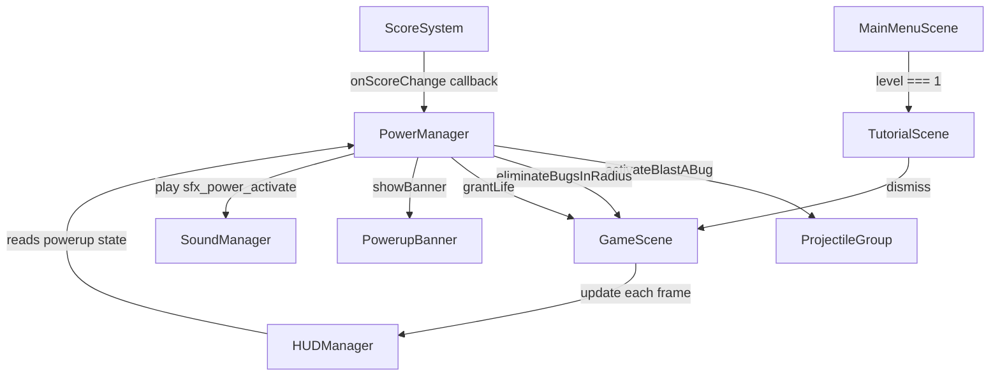

# Design Document — Powerup System

## Overview

The powerup system adds three score-triggered powerups to Bug Busters that fire automatically when the player crosses score milestones. No player input is required to activate them — the `ScoreSystem` callback drives the entire lifecycle.

| Powerup | Threshold | Effect |
|---|---|---|
| Blast-a-Bug | Every 20 pts | Projectiles scaled 2.5× for 5 seconds |
| Bug Free Zone | Every 40 pts | Eliminates all bugs within 50px of Kiro |
| Extra Life | Every 100 pts | +1 life |

Supporting features: a `Powerup_Banner` for on-screen feedback, HUD threshold display, audio cues, and a one-time tutorial scene shown before level 1.

---

## Architecture

The feature extends the existing manager/scene architecture without introducing new architectural layers.



Key design decisions:

- **PowerManager owns all powerup logic.** Threshold detection, effect application, and deduplication all live in `PowerManager.checkMilestones(score, context)`. `GameScene` passes a context object with references to `bugs`, `kiro`, `lives`, `soundManager`, and `banner`.
- **PowerupBanner is a lightweight helper class**, not a full manager. It wraps a single `Phaser.GameObjects.Text` and exposes `show(text)` / `hide()`.
- **TutorialScene is a new Phaser scene** registered in `BootScene` and inserted between `MainMenuScene` and `GameScene` only when `level === 1`.
- **No new constants file entries are needed for thresholds** — the milestone values (20, 40, 100) and effect parameters (5000ms duration, 50px radius, 2.5× scale) are added to `CONSTANTS`.

---

## Components and Interfaces

### PowerManager (extended)

New public method replacing `checkUnlocks`:

```js
/**
 * Evalúa los umbrales de powerup para el score dado y activa los que correspondan.
 * @param {number} score - Puntaje actual del jugador.
 * @param {{ bugs: Array, kiro: Kiro, onLifeGained: Function, soundManager: SoundManager, banner: PowerupBanner }} ctx
 */
checkMilestones(score, ctx)
```

Internal state additions:

```js
// Último score en que cada powerup fue disparado (para deduplicación)
_lastTriggered = { blastABug: -1, bugFreeZone: -1, extraLife: -1 }

// Timestamp hasta el que Blast-a-Bug está activo
_blastABugUntil = 0
```

New getter:

```js
/** @returns {number} Timestamp de expiración de Blast-a-Bug (0 si inactivo) */
get blastABugUntil()
```

Updated `getState()` return shape (adds powerup milestone info):

```js
{
  freeze: PowerState,
  patch_bomb: PowerState,
  blastABug: { active: boolean, remainingMs: number },
  nextBlastABug: number,   // próximo múltiplo de 20 por encima del score actual
  nextBugFreeZone: number, // próximo múltiplo de 40
  nextExtraLife: number    // próximo múltiplo de 100
}
```

### PowerupBanner

New file: `src/managers/PowerupBanner.js`

```js
/**
 * Muestra un mensaje de powerup centrado en pantalla durante 1500 ms.
 */
export class PowerupBanner {
  constructor(scene)   // crea el Text object, depth 500, scrollFactor 0, oculto
  show(text)           // setText, setVisible(true), reinicia el timer de 1500ms
  hide()               // setVisible(false)
}
```

- Depth 500 places it above all gameplay elements (bugs/projectiles at depth 0–10, HUD at depth 100).
- Font: `"Press Start 2P"`, 20px, fill `#ffff00`, centered.
- Uses `scene.time.delayedCall` for the auto-hide timer; calling `show()` again cancels the previous timer.

### HUDManager (extended)

`update(score, lives, level, powerState)` already accepts `powerState`. The shape is extended (see above) to include `nextBlastABug`, `nextBugFreeZone`, `nextExtraLife`, and `blastABug.remainingMs`.

New HUD text objects added in `constructor`:

```js
this._blastABugText   // "BAB: Xpts" or "BAB: Xs"
this._bugFreeZoneText // "BFZ: Xpts"
this._extraLifeText   // "EL: Xpts"
```

Positioned in the lower-right corner to avoid overlap with existing HUD elements.

### TutorialScene

New file: `src/scenes/TutorialScene.js`

```js
export class TutorialScene extends Phaser.Scene {
  constructor() { super({ key: 'TutorialScene' }); }
  init(data)   // stores { level }
  create()     // renders tutorial text + dismiss button/key
  // No update() needed
}
```

Dismiss transitions to `GameScene` with `{ level: 1 }`.

### MainMenuScene (modified)

Change the `startBtn` handler:

```js
startBtn.on('pointerdown', () => {
  const target = progress.level === 1 ? 'TutorialScene' : 'GameScene';
  this.scene.start(target, { level: progress.level });
});
```

### GameScene (modified)

- Instantiate `PowerupBanner` in `create()`.
- Pass context to `PowerManager.checkMilestones` via the `ScoreSystem` callback:

```js
this._scoreSystem = new ScoreSystem((score) => {
  this._powerManager.checkMilestones(score, {
    bugs: this._bugs,
    kiro: this._kiro,
    onLifeGained: () => { this._lives += 1; },
    soundManager: this._soundManager,
    banner: this._banner,
  });
});
```

- Pass updated `powerState` to `HUDManager.update()` each frame.

### BootScene (modified)

Register `TutorialScene` in the scene list.

### CONSTANTS (extended)

```js
// --- Powerups automáticos: umbrales de score ---
POWERUP_BLAST_A_BUG_THRESHOLD: 20,
POWERUP_BUG_FREE_ZONE_THRESHOLD: 40,
POWERUP_EXTRA_LIFE_THRESHOLD: 100,

// --- Blast-a-Bug: parámetros ---
BLAST_A_BUG_DURATION: 5000,       // ms
BLAST_A_BUG_SCALE: 2.5,

// --- Bug Free Zone: radio de efecto ---
BUG_FREE_ZONE_RADIUS: 50,         // px

// --- Banner: duración de visibilidad ---
POWERUP_BANNER_DURATION: 1500,    // ms
```

---

## Data Models

### PowerupMilestoneState

Returned as part of `PowerManager.getState()`:

```js
{
  blastABug: {
    active: boolean,       // true si blastABugUntil > now
    remainingMs: number,   // ms restantes (0 si inactivo)
  },
  nextBlastABug: number,   // Math.ceil((score + 1) / 20) * 20
  nextBugFreeZone: number, // Math.ceil((score + 1) / 40) * 40
  nextExtraLife: number,   // Math.ceil((score + 1) / 100) * 100
}
```

### _lastTriggered

```js
{
  blastABug: number,   // último score en que se disparó (-1 = nunca)
  bugFreeZone: number,
  extraLife: number,
}
```

Deduplication check: `score % threshold === 0 && score !== _lastTriggered[key]`.

---

## Correctness Properties

*A property is a characteristic or behavior that should hold true across all valid executions of a system — essentially, a formal statement about what the system should do. Properties serve as the bridge between human-readable specifications and machine-verifiable correctness guarantees.*

### Property 1: Blast-a-Bug activates on every score multiple of 20

*For any* score value that is a positive multiple of 20, calling `checkMilestones` with that score SHALL activate the Blast-a-Bug powerup (set `blastABugUntil` to a future timestamp), provided that score has not been seen before.

**Validates: Requirements 1.1, 8.1, 8.2**

### Property 2: Blast-a-Bug duration invariant

*For any* time offset `t` after Blast-a-Bug activation, the powerup SHALL be considered active if and only if `t < 5000ms`, and inactive if `t >= 5000ms`.

**Validates: Requirements 1.3, 1.4**

### Property 3: Bug Free Zone eliminates exactly the bugs within 50px

*For any* Kiro position and any set of bug positions, activating Bug Free Zone SHALL eliminate all bugs whose Euclidean distance from Kiro is strictly less than 50px, and SHALL leave all other bugs unaffected.

**Validates: Requirements 2.1, 2.2, 2.5**

### Property 4: Extra Life increments lives by exactly 1

*For any* score that is a positive multiple of 100, calling `checkMilestones` SHALL invoke `onLifeGained` exactly once, increasing the player's life count by exactly 1.

**Validates: Requirements 3.1, 3.4**

### Property 5: Multi-threshold scores activate all applicable powerups

*For any* score that is simultaneously a multiple of 20 and 100 (i.e., a multiple of 100), both Blast-a-Bug and Extra Life SHALL activate in the same `checkMilestones` call. *For any* score that is a multiple of 40 and 100 (i.e., a multiple of 200), Blast-a-Bug, Bug Free Zone, and Extra Life SHALL all activate in the same call.

**Validates: Requirements 3.4, 8.2, 8.3, 8.4**

### Property 6: Threshold deduplication — no re-trigger on same score

*For any* score milestone, calling `checkMilestones` twice with the same score value SHALL activate the corresponding powerup exactly once (idempotence on repeated score values).

**Validates: Requirements 8.5**

### Property 7: Banner replacement resets timer

*For any* two sequential powerup activations, the banner SHALL display the text of the second powerup and the auto-hide timer SHALL be reset to 1500ms from the second activation, regardless of how much time elapsed since the first.

**Validates: Requirements 4.4**

### Property 8: HUD next-threshold computation is correct

*For any* non-negative score `s`, the HUD SHALL display `Math.ceil((s + 1) / 20) * 20` as the next Blast-a-Bug threshold, `Math.ceil((s + 1) / 40) * 40` as the next Bug Free Zone threshold, and `Math.ceil((s + 1) / 100) * 100` as the next Extra Life threshold.

**Validates: Requirements 5.1, 5.2, 5.3**

### Property 9: Tutorial shown only for level 1

*For any* saved progress level greater than 1, the navigation from `MainMenuScene` SHALL route directly to `GameScene` without passing through `TutorialScene`.

**Validates: Requirements 7.1, 7.6**

### Property 10: sfx_power_activate plays exactly once per activation

*For any* powerup activation event, `SoundManager.play('sfx_power_activate')` SHALL be called exactly once, and SHALL not be called at all if the SoundManager is muted.

**Validates: Requirements 1.6, 2.4, 3.3, 6.3, 6.4**

---

## Error Handling

| Scenario | Handling |
|---|---|
| `checkMilestones` called with `score = 0` | No powerup fires (0 is not a positive multiple of any threshold) |
| Bug Free Zone activates with no bugs in range | Sound and banner still play/show; no error (Req 2.5) |
| `onLifeGained` callback is null/undefined | Guard check before invocation; log warning |
| `PowerupBanner.show()` called while timer is pending | Cancel existing `delayedCall`, start new one |
| `TutorialScene` loaded with `level > 1` | Should not happen by design; if it does, transition immediately to `GameScene` |
| Asset `sfx_power_activate` fails to load | `SoundManager.play()` already wraps in try/catch and logs a warning |

---

## Testing Strategy

### Unit tests (example-based)

- `PowerupBanner`: verify text content, font style, depth, and timer duration for each powerup.
- `TutorialScene`: verify all three powerup descriptions are present and dismissal routes to `GameScene`.
- `MainMenuScene`: verify routing to `TutorialScene` at level 1 and directly to `GameScene` at level > 1.
- `AssetLoader`: verify `sfx_power_unlock` and `sfx_power_activate` are registered (smoke).
- `HUDManager`: verify new powerup threshold texts are rendered correctly for specific score examples.

### Property-based tests (fast-check, minimum 100 iterations each)

The project uses `fast-check` with `{ numRuns: 100 }`. Each property test below maps to a design property above.

- **Feature: powerup-system, Property 1**: Generate `fc.integer({ min: 1, max: 500 }).map(n => n * 20)`, verify `blastABugUntil > now` after `checkMilestones`.
- **Feature: powerup-system, Property 2**: Generate `fc.integer({ min: 0, max: 9999 })` for time offset, verify active/inactive boundary at 5000ms.
- **Feature: powerup-system, Property 3**: Generate random Kiro position and array of bug positions, verify elimination matches `dist < 50`.
- **Feature: powerup-system, Property 4**: Generate `fc.integer({ min: 1, max: 100 }).map(n => n * 100)`, verify `onLifeGained` called exactly once.
- **Feature: powerup-system, Property 5**: Use scores `fc.constantFrom(100, 200, 300, 400)`, verify all applicable powerups activate.
- **Feature: powerup-system, Property 6**: Call `checkMilestones` twice with same score, verify activation count is 1.
- **Feature: powerup-system, Property 7**: Activate two powerups in sequence, verify banner text and timer reset.
- **Feature: powerup-system, Property 8**: Generate `fc.integer({ min: 0, max: 10000 })` for score, verify next-threshold formula.
- **Feature: powerup-system, Property 9**: Generate `fc.integer({ min: 2, max: 10 })` for level, verify no tutorial routing.
- **Feature: powerup-system, Property 10**: Activate each powerup type, verify `play` call count; repeat with muted manager, verify 0 calls.

All property tests live in `tests/unit/PowerupSystemProperties.test.js`.
