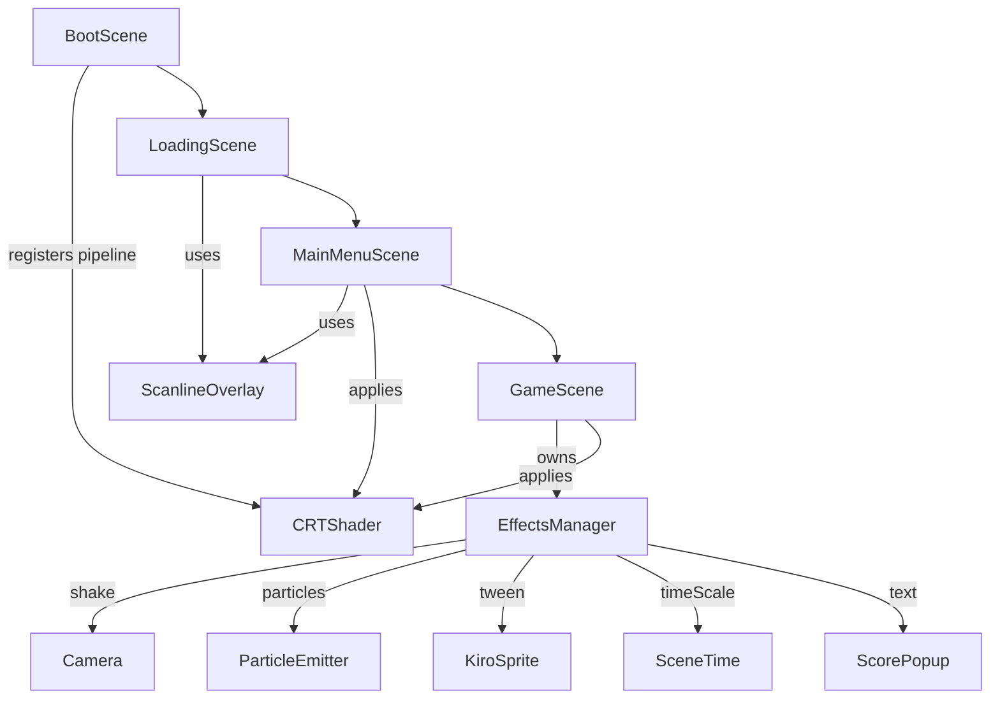

# Design Document — retro-visual-effects

## Overview

This feature adds a full retro visual-polish layer to Bug Busters. Eight distinct effects are introduced:

1. Extended loading screen with CRT scanline aesthetics
2. Screen shake on impactful events
3. Particle burst on enemy elimination
4. Damage blink on Kiro during invincibility
5. Animated title screen (scrolling background, pulsing title, CRT shader)
6. CRT WebGL shader overlay
7. Hit-stop freeze frame on kill
8. Floating score pop-ups

All runtime effect calls are centralised in a new `EffectsManager`. The CRT shader is a new WebGL post-processing pipeline. Existing scenes (`LoadingScene`, `MainMenuScene`, `GameScene`, `BootScene`) are modified minimally to wire in the new components.

---

## Architecture



**Key design decisions:**

- `EffectsManager` receives the scene reference at construction and delegates all Phaser API calls through it. This keeps `GameScene` clean and makes `EffectsManager` independently testable with a mock scene.
- `CRTShader` is registered once in `BootScene` so it is available to all subsequent scenes without re-registration.
- `ScanlineOverlay` is a plain canvas-drawn `Graphics` object used as a fallback when WebGL is unavailable and as the primary overlay in `LoadingScene`.
- The `HitStop` uses `this._scene.time.delayedCall` (not `setTimeout`) so the restore fires relative to the slowed time scale, producing the correct perceived freeze duration.

---

## Components and Interfaces

### `src/managers/EffectsManager.js`

Central hub for all runtime visual effects.

```js
class EffectsManager {
  constructor(scene)                          // stores scene as this._scene
  shake(duration, intensity)                  // cameras.main.shake(duration, intensity)
  spawnParticleBurst(x, y)                    // one-shot particle explosion at (x, y)
  startDamageBlink(sprite)                    // alpha flicker tween on sprite
  triggerHitStop()                            // timeScale → 0.05, restore after HIT_STOP_DURATION
  spawnScorePopup(x, y, points)               // floating "+N" text at (x, y-16)
}
```

Internal state:
- `this._blinkTween` — reference to the active `DamageBlink` tween (or `null`).

### `src/shaders/CRTShader.js`

Phaser WebGL post-processing pipeline.

```js
class CRTShader extends Phaser.Renderer.WebGL.Pipelines.PostFXPipeline {
  constructor(game)
  onPreRender()                               // sets uniforms each frame
}
```

GLSL fragment shader uniforms:
- `vignetteStrength` (float, default `0.4`) — radial darkening towards edges.
- `scanlineAlpha` (float, default `0.15`) — brightness reduction on odd pixel rows.

### `src/scenes/LoadingScene.js` (modified)

- Replaces the existing 10-step timer with a smooth tween-based progress bar that fills over a random duration in `[2000, 3000]` ms.
- Adds `ScanlineOverlay` (drawn via `this.add.graphics()`).
- Adds CRT-flicker tween on the loading text.
- Schedules `scene.start('MainMenuScene')` 400 ms after bar reaches 100%.

### `src/scenes/MainMenuScene.js` (modified)

- Adds a `TileSprite` background using the `tileset` key, scrolled diagonally at 20 px/s in `update()`.
- Adds pulsing scale tween on the title text.
- Adds `ScanlineOverlay`.
- Applies `CRTShader` pipeline to `cameras.main` when WebGL is available.
- Preserves existing `"PRESS START"` blink and scene-transition behaviour.

### `src/scenes/BootScene.js` (modified)

- Registers `CRTShader` with the Phaser renderer before starting `LoadingScene`.

### `src/scenes/GameScene.js` (modified)

- Instantiates `EffectsManager` in `create()`.
- Calls effect methods from `_eliminateBug()`, `_onBugHitKiro()`, and power-activation branches.
- Applies `CRTShader` pipeline to `cameras.main` (with WebGL guard).

### `src/config/constants.js` (modified)

- Adds `HIT_STOP_DURATION: 80`.

---

## Data Models

### EffectsManager internal state

```js
{
  _scene: Phaser.Scene,       // owning scene
  _blinkTween: Tween | null   // active DamageBlink tween reference
}
```

### ParticleBurst config (passed to Phaser particle API)

```js
{
  speed:    { min: 50, max: 150 },
  scale:    { start: 0.5, end: 0 },
  lifespan: 400,
  quantity: 8,
  emitting: false
}
```

### DamageBlink tween config

```js
{
  targets:  sprite,
  alpha:    0.15,
  duration: 100,
  yoyo:     true,
  repeat:   Math.floor(CONSTANTS.INVINCIBILITY_DURATION / 200) - 1,
  onComplete: () => { sprite.alpha = 1.0; }
}
```

### ScorePopup tween config

```js
{
  targets:  textObject,
  y:        textObject.y - 40,
  alpha:    0,
  duration: 600,
  onComplete: () => { textObject.destroy(); }
}
```

### CRTShader uniforms

| Uniform           | Type  | Default | Description                              |
|-------------------|-------|---------|------------------------------------------|
| `vignetteStrength`| float | 0.4     | Radial darkening strength at screen edge |
| `scanlineAlpha`   | float | 0.15    | Brightness reduction on odd pixel rows   |

### ScanlineOverlay parameters

| Parameter    | Value  | Description                              |
|--------------|--------|------------------------------------------|
| stripe height| 2 px   | Height of each dark stripe               |
| gap          | 2 px   | Transparent gap between stripes          |
| pitch        | 4 px   | Total period (stripe + gap)              |
| alpha        | 0.25   | Opacity of each stripe                   |
| stripe count | `Math.ceil(viewportHeight / 4)` | Ensures full coverage |

---

## Correctness Properties

*A property is a characteristic or behavior that should hold true across all valid executions of a system — essentially, a formal statement about what the system should do. Properties serve as the bridge between human-readable specifications and machine-verifiable correctness guarantees.*

### Property 1: ScanlineOverlay covers full viewport without gaps

*For any* viewport height, the number of stripes drawn by `ScanlineOverlay` SHALL equal `Math.ceil(height / 4)`, ensuring no pixel row is left uncovered regardless of whether the height is divisible by the 4 px pitch.

**Validates: Requirements 1.6**

---

### Property 2: shake() delegates parameters unchanged

*For any* duration and intensity values, calling `EffectsManager.shake(duration, intensity)` SHALL invoke `cameras.main.shake` with exactly those same values — no transformation, clamping, or substitution.

**Validates: Requirements 2.5**

---

### Property 3: spawnParticleBurst() positions emitter at given coordinates

*For any* `(x, y)` coordinate pair, calling `EffectsManager.spawnParticleBurst(x, y)` SHALL create the particle emitter at exactly `(x, y)`.

**Validates: Requirements 3.1, 3.5**

---

### Property 4: DamageBlink repeat count matches invincibility duration

*For any* `INVINCIBILITY_DURATION` value, the `repeat` count of the `DamageBlink` tween SHALL equal `Math.floor(INVINCIBILITY_DURATION / 200) - 1`, ensuring the blink covers the full invincibility window without over- or under-running.

**Validates: Requirements 4.2**

---

### Property 5: CRTShader vignette darkens monotonically toward edges

*For any* two pixel positions where one is closer to the screen centre than the other, the vignette pass SHALL produce a brightness value for the closer pixel that is greater than or equal to the brightness of the farther pixel.

**Validates: Requirements 6.2**

---

### Property 6: CRTShader scanline applies to odd rows only

*For any* pixel row index, the scanline pass SHALL reduce brightness by `scanlineAlpha` on odd-indexed rows and leave even-indexed rows unmodified.

**Validates: Requirements 6.3**

---

### Property 7: triggerHitStop() schedules restore with correct duration

*For any* value of `CONSTANTS.HIT_STOP_DURATION`, calling `EffectsManager.triggerHitStop()` SHALL schedule a `delayedCall` with exactly that duration to restore `time.timeScale` to `1.0`.

**Validates: Requirements 7.2**

---

### Property 8: spawnScorePopup() positions text 16px above given coordinates

*For any* `(x, y)` coordinate pair, calling `EffectsManager.spawnScorePopup(x, y, points)` SHALL create the score text at `(x, y - 16)`.

**Validates: Requirements 8.1**

---

### Property 9: _eliminateBug() calls all effects before deactivating the bug

*For any* active bug object, `GameScene._eliminateBug(bug)` SHALL invoke `spawnParticleBurst`, `triggerHitStop`, and `spawnScorePopup` before calling `bug.setActive(false)`.

**Validates: Requirements 9.2**

---

## Error Handling

| Scenario | Handling |
|---|---|
| WebGL not available | `BootScene` guards pipeline registration with `this.renderer.type === Phaser.WEBGL`; scenes fall back to `ScanlineOverlay` |
| Particle emitter creation fails | Wrapped in try/catch; failure is logged via `console.warn` and does not interrupt gameplay |
| `startDamageBlink` called while tween active | Existing tween is stopped via `this._blinkTween.stop()` before creating the new one |
| `triggerHitStop` called while already active | New call overwrites `timeScale`; the earlier restore `delayedCall` still fires and resets to `1.0` (harmless) |
| `spawnScorePopup` called with undefined points | Defaults to `"+0"` via `String(points ?? 0)` |
| `CRTShader` uniform not found | Phaser silently ignores unknown uniforms; no crash |

---

## Testing Strategy

### Unit tests (Jest + mock scene)

Each public method of `EffectsManager` gets a dedicated unit test file at `tests/unit/EffectsManager.test.js`. The Phaser scene is mocked with a minimal object exposing `cameras.main.shake`, `add.particles`, `tweens.add`, `time.delayedCall`, `time.timeScale`, and `add.text`.

Specific example-based tests cover:
- `shake(150, 0.008)` → `cameras.main.shake` called with `(150, 0.008)`
- `spawnParticleBurst` → emitter config matches spec (quantity 8, texture `'projectile'`, lifespan 400)
- `startDamageBlink` → tween alpha target is `0.15`, `yoyo: true`, `onComplete` resets alpha to `1.0`
- `startDamageBlink` called twice → first tween stopped before second starts
- `triggerHitStop` → `timeScale` set to `0.05`, `delayedCall` scheduled with `CONSTANTS.HIT_STOP_DURATION`
- `spawnScorePopup` → text style matches spec, tween `onComplete` calls `destroy()`
- `CRTShader` → class instantiates without error, default uniform values are `0.4` and `0.15`

### Property-based tests (fast-check, minimum 100 runs each)

Located in `tests/unit/EffectsManager.test.js` alongside unit tests, using `fast-check`.

Each property test is tagged with a comment in the format:
`// Feature: retro-visual-effects, Property N: <property text>`

- **Property 1** — `fc.integer({ min: 1, max: 2000 })` for viewport height; assert `stripeCount === Math.ceil(height / 4)`
- **Property 2** — `fc.tuple(fc.integer({ min: 0, max: 10000 }), fc.float({ min: 0, max: 1 }))` for `(duration, intensity)`; assert mock `shake` receives exact values
- **Property 3** — `fc.tuple(fc.integer(), fc.integer())` for `(x, y)`; assert emitter created at `(x, y)`
- **Property 4** — `fc.integer({ min: 200, max: 10000 })` for `INVINCIBILITY_DURATION`; assert `repeat === Math.floor(duration / 200) - 1`
- **Property 5** — `fc.tuple(fc.float({ min: 0, max: 1 }), fc.float({ min: 0, max: 1 }))` for two normalised distances from centre; assert brightness is monotonically non-increasing with distance (pure GLSL logic extracted to a JS helper)
- **Property 6** — `fc.integer({ min: 0, max: 1000 })` for row index; assert scanline reduction applied iff `row % 2 !== 0`
- **Property 7** — `fc.integer({ min: 1, max: 500 })` for `HIT_STOP_DURATION`; assert `delayedCall` receives that exact value
- **Property 8** — `fc.tuple(fc.integer(), fc.integer(), fc.integer({ min: 0 }))` for `(x, y, points)`; assert text created at `(x, y - 16)`
- **Property 9** — `fc.record({ x: fc.integer(), y: fc.integer(), pointValue: fc.integer({ min: 1 }) })` for bug; assert call order via mock call-order tracking

### Integration notes

- `CRTShader` GLSL correctness (Properties 5 and 6) is tested by extracting the vignette and scanline math into pure JS helper functions that mirror the GLSL, then property-testing those helpers. The actual WebGL pipeline is not instantiated in Jest.
- `LoadingScene` and `MainMenuScene` changes are covered by example-based tests verifying tween/timer parameters; full visual output is not asserted.
